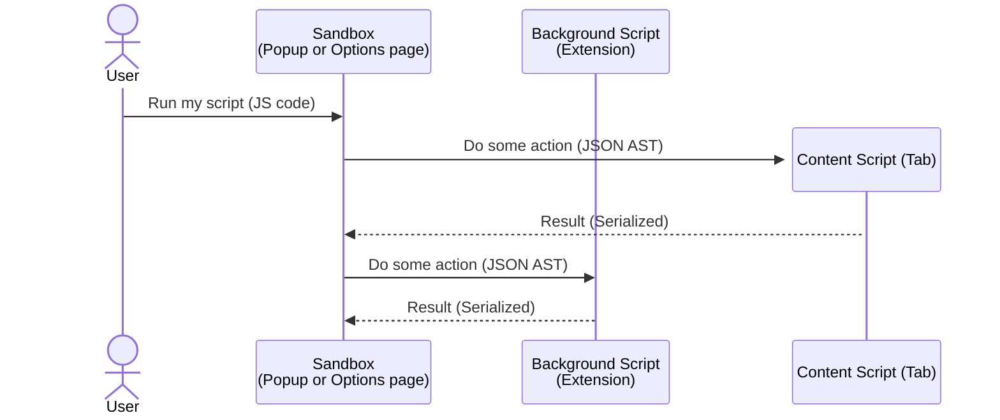

# Architecture

## Execution flow

```mermaid
sequenceDiagram
  actor User
  participant sb as Sandbox<br />(Popup or Options page)
  participant bg as Background Script<br />(Extension)
  User ->> sb: Run my script (JS code)
  create participant cs as Content Script (Tab)
  sb ->>+ cs: Do some action (JSON AST)
  cs -->> sb: Result (Serialized)
  sb ->> bg: Do some action (JSON AST)
  bg -->> sb: Result (Serialized)
```
